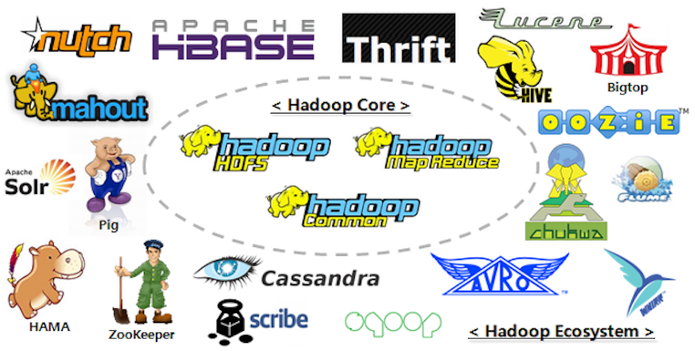
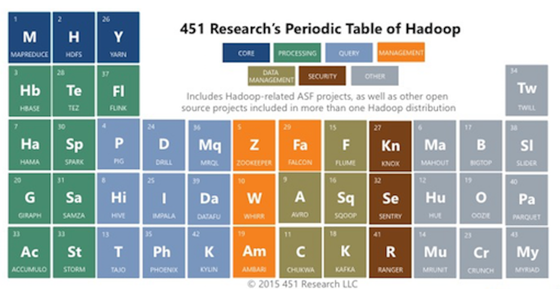

class: center, middle

# Using the Big Data Cluster

---

# Getting Access to the `bigdata` Cluster 

The bigdata cluster is available for use by the Vanderbilt community.
Users should [contact ACCRE](http://www.accre.vanderbilt.edu/?page_id=367) 
to get access to the cluster. 

---

class: center, middle

# Hadoop


---

class: center, middle

# The Hadoop Ecosystem



---

class: center, middle

# The Hadoop Ecosystem




---

# How did we get to this point?

Industry need

---

# Hadoop command line

To interact with the HDFS filesystem, use the `hadoop fs` command:

```
[arnoldjr@abd740 ~]$ hadoop fs -ls /
Found 5 items
drwxr-xr-x   - hdfs  supergroup          0 2017-04-19 13:47 /data
drwxr-xr-x   - hbase hbase               0 2017-04-02 21:09 /hbase
drwxrwxr-x   - solr  solr                0 2017-02-24 17:20 /solr
drwxrwxrwx   - hdfs  supergroup          0 2017-05-06 00:26 /tmp
drwxr-xr-x   - hdfs  supergroup          0 2017-02-17 12:14 /user
[arnoldjr@abd740 ~]$ hadoop fs -ls /data
Found 9 items
-rw-r--r--   3 hdfs    supergroup       3359 2017-02-14 09:57 /data/Spark_README.md
drwxr-xr-x   - hdfs    supergroup          0 2017-03-06 16:25 /data/babs
drwxr-xr-x   - hdfs    supergroup          0 2017-03-06 11:52 /data/capitalbikeshare-data
drwxr-xr-x   - hdfs    supergroup          0 2017-03-06 12:10 /data/citibike-tripdata
drwxr-xr-x   - hdfs    supergroup          0 2017-02-14 21:10 /data/google-ngrams
-rw-r--r--   3 hdfs    supergroup  274188932 2017-04-19 13:47 /data/hadoop-2.5.0-cdh5.2.0.tar.gz
drwxr-xr-x   - hdfs    supergroup          0 2017-01-18 19:06 /data/nyc-tlc
drwxr-xr-x   - hdfs    supergroup          0 2016-12-21 15:14 /data/stack-archives
```

---

# Overview of Cloudera Services

| Service          | Description 
|:-----------------|:------------
| YARN             | Yet Another Resource Negotiator 
| Oozie            | Web app for scheduling Hadoop jobs 
| MapReduce 2      | MapReduce jobs running on top of YARN 
| Hue              | User interface for constructing Jobs 
| Spark            | MapReduce-like + cacheing 
| Hive             | ETL transformations expressed as SQL
| Impala           | Interactive SQL 
| HBase            | Random, realtime read/write access to distributed big data store
| Pig              | High-level language for expressing data analysis programs 
| Solr             | Text search engine supporting free form queries 


---


---

# Logging on to the Cluster via Hue

Once approved, users will be
able to connect to `bigdata.accre.vanderbilt.edu` via `ssh`, but Cloudera 
Manager provides a WebUI to interact with the cluster called Hue.
To access Hue, simply to `bigdata.accre.vanderbilt.edu:8888` in your web browser
and enter your credentials.

---

# Using the HDFS file browser

--

If you've used the web UIs for Dropbox, Google Drive, etc., then this step
is a piece of cake. The File Browser is accessed from the 
dog-eared-piece-of-paper icon near the top right of the screen. In the file
broswer, you're able to navigate the directory structure of HDFS and even
view the contents of text files.

---

## Using the HDFS file browser

- When a new user logs into Hue, Hue creates an HDFS directory for that user
at `/user/<vunetid>` which becomes that user's home directory.

--

- *Note that, by default, logging in to Hue creates a new user's home directory
with read and execute permissions enabled for the world!*

--

- Files can be uploaded to your directories using the drag-and-drop mechanism; however, 
the file size for transferring through the WebUI is capped at around 50GB, 
so other tools like `scp` or `rsync` are necessary for moving large files
onto the cluster.

---

## Using the HDFS file browser

In addition to your own data, ACCRE hosts some publicly available datasets
at `/data/`:

|Directory             | Description
|:-------------------- |:-----------
|babs                  | Bay Area bikeshare data
|capitalbikeshare data | DC area bikeshare data
|citibike-tripdata     | NYC bikeshare data
|google-ngrams         | n-grams collected from Google Books
|nyc-tlc               | NYC taxi trip data
|stack-archives        | historic posts from StackOverflow, et al.

If you know of other datasets that may appeal to the Vanderbilt community at
large, just let us know!

---

# Building an application

Hue uses Oozie to compose workflows on the cluster, and to access it, you'll 
need to follow the tabs `Workflows -> Editors -> Workflows`. 

--

From here, click
the `+ Create` button, and you'll arrive at the workflow composer screen. You
can drag and drop an application into your workflow, for instance a Spark job. 
Here you can specify the jar file (which, conveniently, 
you can generate from our 
[GitHub repo](https://github.com/bigdata-vandy/spark-wordcount)) 
and specify options and inputs.

--

If you want to interactively select your input and output files each time you
execute the job, you can use the special keywords `${input}` and `${output}`, which
is a nice feature for generalizing your workflows.

---

# Wordcount in Spark

This content is adapted slightly from the 
[Spark getting started guide](http://spark.apache.org/docs/latest/quick-start.html). 
Users can execute the same commands in the Spark REPL, which is launched by running in bash 

```bash
$SPARK_HOME/bin/spark-shell
```
where the environment variable `$SPARK_HOME` points to an installation of Spark.

<iframe width="100%" height="250" 
src="http://spark.apache.org/docs/latest/quick-start.html"></iframe>

---

## Read in a text file using the SparkContext

- The SparkContext `sc` is the entry point for Spark's data structures.  
- The value `textFile` becomes an RDD (Resilient Distributed Dataset)

```scala
val textFile = sc.textFile("spark_read_me.txt")
```

- The RDD cannot be viewed directly in the REPL (in practice it will be distributed across many nodes!!). 
Thus, in order to view all the data, we have to gather the data at a single node using `collect`. 
A summary of RDD functions can be found 
[here](http://spark.apache.org/docs/latest/programming-guide.html#rdd-operations).


```scala
(textFile collect) foreach println
```

    # Apache Spark
    
    Spark is a fast and general cluster computing system for Big Data. It provides
    high-level APIs in Scala, Java, Python, and R, and an optimized engine that
    supports general computation graphs for data analysis. It also supports a
    rich set of higher-level tools including Spark SQL for SQL and DataFrames,
    MLlib for machine learning, GraphX for graph processing,
    and Spark Streaming for stream processing.
    
    <http://spark.apache.org/>

---


## Filter lines containing Spark

- The RDD (and Scala collections) support filtering

```scala
val linesWithSpark = textFile.filter(line => line.contains("Spark"))
(linesWithSpark collect) foreach println
```

    # Apache Spark
    Spark is a fast and general cluster computing system for Big Data. It provides
    rich set of higher-level tools including Spark SQL for SQL and DataFrames,
    and Spark Streaming for stream processing.
    You can find the latest Spark documentation, including a programming
    ## Building Spark
    Spark is built using [Apache Maven](http://maven.apache.org/).
    To build Spark and its example programs, run:
    ["Building Spark"](http://spark.apache.org/docs/latest/building-spark.html).
    The easiest way to start using Spark is through the Scala shell:
    Spark also comes with several sample programs in the `examples` directory.
        ./bin/run-example SparkPi
        MASTER=spark://host:7077 ./bin/run-example SparkPi
    Testing first requires [building Spark](#building-spark). Once Spark is built, tests
    Spark uses the Hadoop core library to talk to HDFS and other Hadoop-supported
    Hadoop, you must build Spark against the same version that your cluster runs.
    in the online documentation for an overview on how to configure Spark.


---

## Map lines from String to Array[String]
The RDD (and Scala collections) support mapping. For example:


```scala
val foo = "a line with Spark"
foo.split(" ") 
```

    Array(a, line, with, Spark)

--

### Scala Bonus!
The dot operator can be omitted in Scala, so that splitting operation can be written as:


```scala
foo split (" ")
```

    Array(a, line, with, Spark)

---

# Let's split each line

```scala
val arraysWithSpark = linesWithSpark.map(line => line split(" "))
val wordsPerLine = arraysWithSpark map (a => a.size)
(wordsPerLine collect) foreach println
```

    3
    14
    12
    6
    10
    3
    6
    .
    .
    .


---

## Counting words per line

- Spark and Scala allow for chaining operations together. Thus, we can just write:


```scala
val wordsPerLine = linesWithSpark.map(line => line split(" ")).map(a => a.size)
(wordsPerLine collect) foreach println
```

    3
    14
    12
    6
    10
    3
    6
    .
    .
    .

---

## Counting words per line


- Equivalently:

```scala
val wordsPerLine = linesWithSpark map(_ split " ") map(_ size)
(wordsPerLine collect) foreach println
```

    3
    14
    12
    6
    10
    3
    6
    .
    .
    .

Here, Scala is smart enough to understand that the underscore implies that the 
map function is taking a single argument, thus avoiding the need for the 
`foo => foo split(" ")` pattern. 

*Scala Bonus! this pattern defines an anonymous function.*

---

## Counting total "Spark" occurrences with `flatMap`

If we wanted to count total occurrence of *Spark* we could filter our `Array`s 
from the previous step to keep only those words that match *Spark*. Since we 
don't actually care about which line contains occurrences of *Spark* but rather 
how many *Spark*s are in our entire document, we can consider all the individual 
words at once. Spark provides a mechanism to do this called `flatMap`.


```scala
val allSparkWords = linesWithSpark flatMap (line => line split " ")
(allSparkWords collect) foreach println
```

    #
    Apache
    Spark
    Spark
    is
    a
    fast
    and
    general
    cluster
    computing
    system
    for
    Big
    .
    .
    .

---

To get the Spark occurrences, simply filter:


```scala
val allSparkWords = linesWithSpark flatMap (_ split "\\s+") filter (_ == "Spark")
(allSparkWords collect) foreach println
```

    Spark
    Spark
    Spark
    Spark
    Spark
    Spark
    Spark
    Spark
      .
      .
      .

*Scala Bonus! `"\\s+"` is a regex that matches one or more consecutive whitespace characters.*

---

# Counting occurrences of each word

- The classic MapReduce example (as popularized by [Hadoop](http://hadoop.apache.org/))
- Split each line into words 
- Map each word into a word value *pair*, or `Tuple`, e.g. `(the, 100)`
  - First element is the *key* which serves as identifier 
  - Second element is the *value* which signifies that each word has occurred one time. 
  
Since each word is not unique, we need to group them 
together and count the occurrences per group. When we perform an *action* on 
an RDD, all the pairs with identical keys are sent to the same node and then 
we can aggregate these together. This is precisely what the `reduceByKey` 
function does:

```scala
val wordFrequencies = textFile flatMap (_ split ("\\s+") map (word => (word, 1))) reduceByKey (_ + _)
(wordFrequencies take 20) foreach println
```

    (package,1)
    (this,1)
    (Version"](http://spark.apache.org/docs/latest/building-spark.html#specifying-the-hadoop-version),1)
    (Because,1)
    (Python,2)
    (cluster.,1)
    (its,1)
    .
    .
    .


---

# Reduce

The argument to `reduceByKey` is a function describing how to combine values 
(which must have the same type, otherwise see `aggregateByKey`). To print the 
output, we've usen the `take` function to take the first 20 results. We can 
also use the aptly named `takeOrdered` function:

```scala
(wordFrequencies.takeOrdered(50)(Ordering[Int].reverse.on(_._2))) foreach println
```

    (,43)
    (the,21)
    (to,14)
    (Spark,13)
    (for,11)
    (and,10)
    (a,8)
    (##,8)
    (run,7)
    (is,6)
    (can,6)
    (on,5)
    (in,5)
    (of,5)
    (also,4)
    .
    .
    .

---
class: center, middle

# Under the Hood of MapReduce


*Original source: <http://xiaochongzhang.me/blog/>*

---

# Conclusions


- Many tools are available

--

- It's import to know which tool is best suited for each job

--

- Go Forth and Compute!

---

