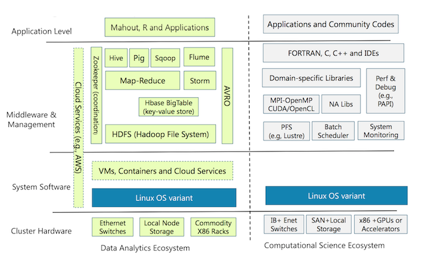
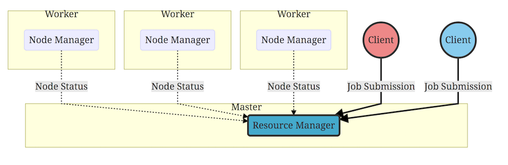
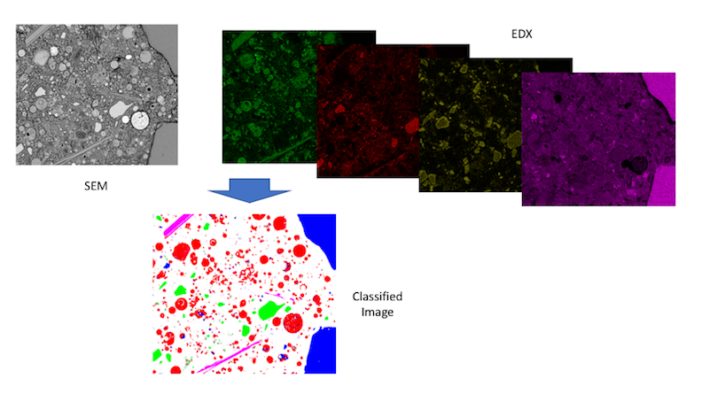
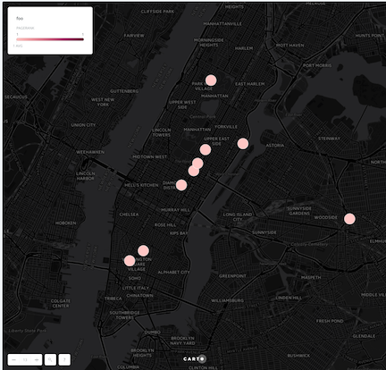

class: center, middle

# Introduction to Using Spark on the Big Data Cluster

---

# Getting Help

- Submit a ticket to [the Helpdesk](http://www.accre.vanderbilt.edu/?page_id=369)

- Join the accre-forum Slack team!
  - https://accre-forum.slack.com/signup
  - Use your Vanderbilt email address to register
  - Join the `#bigdata` channel to communicate and collaborate

- Check out our GitHub organization at [github.com/bigdata-vandy](https://github.com/bigdata-vandy)

- Check out our blog at [bigdata-vandy.github.io](https://bigdata-vandy.github.io/)

- Schedule a meeting for your research group

---

class: center, middle

# The Hadoop Ecosystem


---

# How is Big Data different from HPC?

| Traditional HPC 						         | Big Data 
|:-------------------------------------|:--------
| Move the data to the code            | Move the code to the data
| Centralized storage via GPFS         | Distributed storage via HDFS 
| Perfomant languages (C/C++, Fortran) | Abstract languages (Java, Scala, Python)
| Imperative programming               | Functional programming 

--

### Candidates for Big Data solutions:

- Lots of data

- Embarrasingly parallel data processing

- Machine learning

- Network analysis

- Processing/analysis of streaming data 


---
class: center, middle

# Divergent Ecosystems



Dan Reed, “Clouds, Big Data, and the Future of Computing,” CASC Fall 2015 Meeting, Washington, D.C.


---

# BigData Test Cluster - Available Now!

Initial deployment for testing, prototyping, and benchmarking only, using recycled hardware

- 3 management nodes
  - 8 CPU cores, 92 GB RAM per node
- 6 data nodes
  - 8 TB, 8 CPU cores, 92 GB RAM per node

--

# BigData Production Environment - Available Fall 2017 

Newly purchased hardware!!

- 4 management nodes
  - 16 CPU cores, 128 GB RAM per node
- 9 data nodes
  - 80 TB, 32 CPU cores, 512 GB RAM per node

---

# BigData Cluster Management with Cloudera 

Cloudera Manager is used to deploy, configure, and manage the bigdata cluster

--

| Service          | Description 
|:-----------------|:------------
| HDFS             | Hadoop Distributed File System - replicated, partitioned data 
| YARN             | Yet Another Resource Negotiator 
| MapReduce 2      | MapReduce jobs running on top of YARN 
| Spark            | MapReduce-like + cacheing 
| Oozie            | Web app for scheduling Hadoop jobs 
| Hue              | User interface for constructing Jobs 
| Hive             | ETL transformations expressed as SQL
| Impala           | Interactive SQL 
| HBase            | Random, realtime read/write access to distributed big data store
| Pig              | High-level language for expressing data analysis programs 
| Solr             | Text search engine supporting free form queries 

---

# Technologies for this Presentation 

| Service          | Function 
|:-----------------|:------------
| HDFS             | Store data in a distributed/replicated manner
| YARN             | Schedule and run jobs, acquiring resources as necessary
| Spark            | Perform map-reduce with data persistence in memory + much, much more

---

# What is HDFS?

- Distributed file system
 
- Designed to run on commodity hardware 

- Highly fault-tolerant (through replication)

- Suitable for applications that have large data sets 

---
class: center, middle
# HDFS Magic


---

# Interacting with HDFS  

The HDFS filesystem uses Unix-like commands for 
common operations, prefixed with the `hadoop fs` command, e.g.:

```
$ hadoop fs -ls /
Found 5 items
drwxr-xr-x   - hdfs  supergroup          0 2017-04-19 13:47 /data
drwxr-xr-x   - hbase hbase               0 2017-04-02 21:09 /hbase
drwxrwxr-x   - solr  solr                0 2017-02-24 17:20 /solr
drwxrwxrwx   - hdfs  supergroup          0 2017-05-06 00:26 /tmp
drwxr-xr-x   - hdfs  supergroup          0 2017-02-17 12:14 /user
```
--

```
$ hadoop fs -ls /data
Found 9 items
-rw-r--r--   3 hdfs    supergroup       3359 2017-02-14 09:57 /data/Spark_README.md
drwxr-xr-x   - hdfs    supergroup          0 2017-03-06 16:25 /data/babs
drwxr-xr-x   - hdfs    supergroup          0 2017-03-06 11:52 /data/capitalbikeshare-data
drwxr-xr-x   - hdfs    supergroup          0 2017-03-06 12:10 /data/citibike-tripdata
drwxr-xr-x   - hdfs    supergroup          0 2017-02-14 21:10 /data/google-ngrams
-rw-r--r--   3 hdfs    supergroup  274188932 2017-04-19 13:47 /data/hadoop-2.5.0-cdh5.2.0.tar.gz
drwxr-xr-x   - hdfs    supergroup          0 2017-01-18 19:06 /data/nyc-tlc
drwxr-xr-x   - hdfs    supergroup          0 2016-12-21 15:14 /data/stack-archives
```
--

*This is not the same `/data` as on GPFS*

---

# HDFS

Common arguments for the [`hadoop fs` command](https://hadoop.apache.org/docs/r2.7.1/hadoop-project-dist/hadoop-common/FileSystemShell.html#createSnapshot):

| Argument        | Description                         
|:----------------|:------------------------------------
| `cat`						| concatenate file contents to stdout 
| `copyFromLocal` | copy from local filesystem to HDFS  
| `copyToLocal`   | copy from HDFS to local disk         
| `du`            | calculate disk usage                
| `moveFromLocal` | copy to HDFS and remove local copy  
| `moveToLocal`   | copy to local drive and remove HDFS copy 
| `rm`            | remove files and folders from HDFS

--

Command outputs can be piped, just like normal Unix commands, for example

```
hadoop fs -cat /user/fido/my-file | head -100
``` 

---

# Apache Hadoop YARN

- Yet Another Resource Negotiator
- Functionalities:
	- resource management 
	- job scheduling/monitoring 



--

- YARN effectively fills the same role as SLURM
- Resource allocation is essentially transparent to the user

---

# What is Spark?

> Apache Spark is a fast and general-purpose cluster computing system. 
> It provides high-level APIs in Java, Scala, Python and R, 
> and an optimized engine that supports general execution graphs. 


Spark can run in:
- Standalone mode, e.g. [Spark on GPFS](https://bigdata-vandy.github.io/spark/slurm/2017/02/08/using-spark-with-gpfs.html)
- on YARN
- on Mesos

---

# How to execute Spark code

- Interactive jobs: Spark REPL, a command line tool to "Read Evaluate Print Loop" Spark/Scala code
  - In general: `$SPARK_HOME/bin/spark-shell`
  - On the cluster: 
    - `spark-shell` or `pyspark` (v. 1.6.0)
    - `spark2-shell` or `pyspark2` (v. 2.0.0)

--

- Batch jobs:
  - In general: `$SPARK_HOME/bin/spark-submit`
  - On the cluster: 
    - `spark-submit <jar-file>` or `spark-submit <python-file>` (v. 1.6.0) 
    - `spark2-submit <jar-file>` or `spark2-submit <python-file>` (v. 2.0.0)


--

*On the `bigdata` cluster, `spark-submit` calls on YARN to automatically distributes jobs.* 

---

# Wordcount in Spark

- Wordcount is the "Hello World" application for Hadoop
- Count the occurrences of all words in a text file
- Use the Scala REPL

--
- This content is adapted slightly from the [Spark getting started guide](https://spark.apache.org/docs/2.0.0-preview/quick-start.html). 

<iframe width="100%" height="300" 
src="https://spark.apache.org/docs/2.0.0-preview/quick-start.html"></iframe>

---

## Read in a text file using the SparkContext

- The `SparkContext` class `sc` is the entry point for the Spark API, and is already created in the REPL 

```scala
scala> val linesRDD = sc.textFile("spark_read_me.txt")
linesRDD: org.apache.spark.rdd.RDD[String] = spark_read_me.txt MapPartitionsRDD[1] at textFile at <console>:24
```
--

- The value `linesRDD` is an instance of an `RDD` (Resilient Distributed Dataset)

--

- RDDs are essential to Spark
	- a fault-tolerant collection of elements that can be operated on in parallel
  - parellelism happens *automagically*!

---

## View the contents of  the `linesRDD` RDD

- Since RDDs are distributed across nodes, they cannot be viewed directly in the REPL 
- To view an RDD, gather all the data at a single node using `collect`. 

```scala
scala> linesRDD.collect.foreach(println)
# Apache Spark

Spark is a fast and general cluster computing system for Big Data. It provides
high-level APIs in Scala, Java, Python, and R, and an optimized engine that
supports general computation graphs for data analysis. It also supports a
rich set of higher-level tools including Spark SQL for SQL and DataFrames,
MLlib for machine learning, GraphX for graph processing,
and Spark Streaming for stream processing.

<http://spark.apache.org/>
.
.
.
```
---

## Map lines from `String` to `Array[String]`
The RDD (and Scala collections) support mapping. For example, the pure Scala expression:

```scala
scala> val foo: String = "a line with Spark"
```

Can be mapped into an array of strings delimited by whitespace

```scala
scala> foo.split(" ")
res0: Array[String] = Array(a, line, with, Spark)
```
---

## Counting words per line

The same splitting operation can be applied to each element of the `RDD[String]`

```scala
scala> val words: RDD[Array[String]] = linesRDD.map(line => line.split(" "))
words: org.apache.spark.rdd.RDD[Array[String]] = MapPartitionsRDD[3] at map at <console>:27
```

--

Taking the size of each `Array[String]` element of the `RDD` will yield the total words per each line

```scala
scala> val wordsPerLine: RDD[Int] = words.map(a => a.size)
wordsPerLine: org.apache.spark.rdd.RDD[Int] = MapPartitionsRDD[5] at map at <console>:29

scala> wordsPerLine.take(5).foreach(println)
3
1
14
13
11
```

---

# Total words

To get the total words for the document, we can simply sum up the `wordsPerLine` `RDD`:

```scala
scala> val total: Int = wordsPerLine.reduce((a, b) => a + b)
total: Int = 507
```

--

- The function passed to `reduce` specifies how to combine two `Int` elements.
- The order of combining the `RDD` elements must not matter

--

Notice that `total` is no longer an `RDD` but a regular Scala `Int`.

---

# The MapReduce Paradigm

- Map: transform the data
  - `map`
  - `filter`
  - `flatMap`
  - `join`
  - `union`
  - `intersection`
  - et al.

- Reduce: aggregate the data
  - `reduce`
  - `count`
  - `sample`
  - et al.

---

# WordCount: Count the occurrences of each word in a document

- Pseudocode:
  - Map each line into an array of words 
  - Map each word into a word-value *pair*, or `Tuple`, e.g. `(the, 101)`
      + First element is the *key* which serves as identifier 
      + Second element is the *value* which, in this case, signifies that each word has occurred one time. 
  - Group all word-value pairs by word, and sum up the values for each word

--

- Key-Value pairs: mechanism for allowing `groupBy` operations
  - All the RDD elements of a given key are guaranteed to on the same worker during aggregations
  - `reduceByKey` combines values of a given key:

--

```scala
scala> val wordFrequencies = linesRDD.flatMap( line => line.split(" ").map(word => (word, 1)) ).
     | reduceByKey((a, b) => a + b)
wordFrequencies: org.apache.spark.rdd.RDD[(String, Int)] = ShuffledRDD[7] at reduceByKey at <console>:28
```
-- 

Note that `wordFrequencies` is now a `ShuffledRDD`


---

# WordCount

```scala
scala> wordFrequencies.takeOrdered(20).foreach(println)
(,67)                                                                           
("local",1)
("local[N]",1)
("yarn",1)
(#,1)
(##,8)
((You,1)
(-DskipTests,1)
(./bin/pyspark,1)
(./bin/run-example,2)
(./bin/spark-shell,1)
(./dev/run-tests,1)
(1000).count(),1)
(1000:,2)
(<class>,1)
(<http://spark.apache.org/>,1)
(>>>,1)
(A,1)
(APIs,1)
(About,1)
```

---
class: center, middle

# Under the Hood of Map-Reduce


---

# Spark higher-level tools 

| Library         | Function
|:----------------|:---------
| Spark SQL       | SQL and structured data processing
| MLlib           | machine learning
| GraphX          | graph processing
| Spark Streaming | real-time analysis of data streams


---

# Spark DataFrames

- Analogous to data frames in R and Pandas
- Can be automatically created from CSV, Parquet, JSON lines files

```
val df: DataFrame = spark.read
    .option("header", true)
    .option("treatEmptyValuesAsNulls", true)
    .option("inferSchema", true)
    .csv("/data/nyc-tlc/yellow_tripdata_2016-04.csv")

df.show()
```

		+---------+-------------------+-------------------+---------------+-------------+----------------+
		|vendor_id|    pickup_datetime|   dropoff_datetime|passenger_count|trip_distance|pickup_longitude|
		+---------+-------------------+-------------------+---------------+-------------+----------------+
		|      CMT|2013-01-01 15:11:48|2013-01-01 15:18:10|              4|          1.0|      -73.978165|
		|      CMT|2013-01-06 00:18:35|2013-01-06 00:22:54|              1|          1.5|       -74.00668|
		|      CMT|2013-01-05 18:49:41|2013-01-05 18:54:23|              1|          1.1|      -74.004711|
		|      CMT|2013-01-07 23:54:15|2013-01-07 23:58:20|              2|          0.7|        -73.9746|
		|      CMT|2013-01-07 23:25:03|2013-01-07 23:34:24|              1|          2.1|      -73.976252|
		|      CMT|2013-01-07 15:27:48|2013-01-07 15:38:37|              1|          1.7|      -73.966743|
		|      CMT|2013-01-08 11:01:15|2013-01-08 11:08:14|              1|          0.8|      -73.995801|
		|      CMT|2013-01-07 12:39:18|2013-01-07 13:10:56|              3|         10.7|      -73.989937|
		|      CMT|2013-01-07 18:15:47|2013-01-07 18:20:47|              1|          0.8|      -73.980071|
		|      CMT|2013-01-07 15:33:28|2013-01-07 15:49:26|              2|          2.5|      -73.977937|
		|      CMT|2013-01-08 13:11:52|2013-01-08 13:19:50|              1|          1.3|      -73.982456|
		|      CMT|2013-01-08 09:50:05|2013-01-08 10:02:54|              1|          0.7|      -73.995561|


---

# SQL queries on Spark DataFrames

```scala
scala> val coords = df.select("pickup_longitude", "pickup_latitude")
coords: org.apache.spark.sql.DataFrame = [pickup_longitude: string, pickup_latitude: string]
scala> coords.show(5)
+-------------------+------------------+
|   pickup_longitude|   pickup_latitude|
+-------------------+------------------+
|-73.990211486816406|40.750968933105469|
|-73.935188293457031| 40.80072021484375|
|-73.963752746582031|40.767936706542969|
|-73.997177124023438|40.742168426513672|
|-74.006843566894531|40.730266571044922|
+-------------------+------------------+
only showing top 5 rows
```

--

- DataFrames cast to RDDs return RDDs of rows

```scala
scala> val dist = df.select("trip_distance").rdd.map({ case Row(d: String) => d.toDouble }).mean
dist: Double = 15.7432129086462 
```

---

# Spark MLLib

- Spark's machine learning library
- Spark MLLib - RDD API (code maintenance only)
- Spark ML - DataFrame API
- Provides many common clustering and classification algorithms

--

```
val training: DataFrame

val lr = new LogisticRegression()
  .setMaxIter(10)
  .setRegParam(0.3)
  .setElasticNetParam(0.8)

// Fit the model
val lrModel = lr.fit(training)

// Print the coefficients and intercept for logistic regression
println(s"Coefficients: ${lrModel.coefficients} Intercept: ${lrModel.intercept}")
```

---

# Image Classification

[spark-sem-classify on GitHub](https://github.com/bigdata-vandy/spark-sem-classify)



---

## Image Classification

```scala
// Assemble feature columns into a single column
val assembler =  new VectorAssembler()
    .setInputCols(Array("bse", "ca", "si", "al", "mg",
      "o", "s", "k", "na", "fe"))
    .setOutputCol("features")

// Index labels, adding metadata to the label column.
val labelIndexer = new StringIndexer()
    .setInputCol("label")
    .setOutputCol("indexedLabel")
    .fit(data)

// Specify a RandomForest model.
val rf = new RandomForestClassifier()
    .setFeaturesCol("features")
    .setLabelCol("indexedLabel")
    .setNumTrees(30)

// Convert indexed labels back to original labels.
val labelConverter = new IndexToString()
    .setInputCol("prediction")
    .setOutputCol("predictionLabel")
    .setLabels(labelIndexer.labels)

// Chain indexers and forest in a Pipeline
val pipeline = new Pipeline()
    .setStages(Array(assembler, labelIndexer, rf, labelConverter))
```

---

## Image Classification

```scala
// We now treat the Pipeline as an Estimator, wrapping it in a CrossValidator instance.
// This will allow us to jointly choose parameters for all Pipeline stages.
// A CrossValidator requires an Estimator, a set of Estimator ParamMaps, and an Evaluator.
// Note that the evaluator here is a BinaryClassificationEvaluator and its default metric
// is areaUnderROC.
val cv = new CrossValidator()
    .setEstimator(pipeline)
    .setEvaluator(evaluator)
    .setEstimatorParamMaps(paramGrid)
    .setNumFolds(3)  // Use 3+ in practice

// Train model.  This also runs the indexers.
val cvModel = cv.fit(trainData)
```

---

# Spark GraphX

- Graph-parallel computation

--

- For example, calculate the most popular taxi pickup/dropoff location in NYC using PageRank



---

# Network Analysis

```scala
// Construct the edges
// Join the dropoff with it's index
val edges: RDD[Edge[String]] = pickups.map {
	case (_, (Row(_: Point, p1: Point), v0: Long)) =>
		(p1.round, v0)
} .join(indexed).values
		.map { case (v0: Long, v1: Long) => Edge(v0, v1, "foo") }

// Reformat indexed to be vertices
val vertices: RDD[(VertexId, Point)] = indexed.map({
	case (p: Point, v: Long) => (v, p)
})

// Specify default point
val defaultPoint = Point(-1.0, -1.0)

// Create the graph
val graph = Graph(vertices, edges, defaultPoint)

// Run PageRank
val ranks = graph pageRank 0.0001 vertices

ranks take 10 foreach println
```


---

# Pro Tips

1. Read the docs!

--

1. Find example code!!

--

1. Use a good IDE!!!
  - type-checking
  - syntax highlighting
  - tab-completion
  - suggestions: [IntelliJ IDEA CE](https://www.jetbrains.com/idea/download) and [PyCharm CE](https://www.jetbrains.com/pycharm/download)
